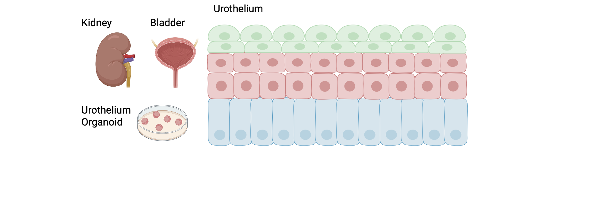

# KUDO Single-Cell RNA-seq Integration Pipeline

## Overview
The urothelium is a specialized stratified epithelium lining the inner surface of the urinary tract, including the renal pelvis, ureters, bladder, and proximal urethra. It serves as a highly dynamic permeability barrier that protects underlying tissues from the toxic and osmotic stress of urine. The urothelium is organized into three functionally distinct layers: a basal progenitor layer capable of self-renewal, an intermediate transitional layer, and a superficial layer of terminally differentiated umbrella cells  that form tight junctions and apical plaques to maintain barrier integrity. Beyond its passive barrier role, the urothelium actively senses mechanical stimuli — including bladder filling and pressure changes — through mechanosensitive ion channels such as PIEZO1, and communicates bidirectionally with the underlying lamina propria via paracrine signaling. Disruption of urothelial integrity is a hallmark of obstructive uropathies and contributes to inflammation, fibrosis, and progressive kidney injury, making it a critical target for understanding disease pathogenesis.



This repository contains scripts for preprocessing and integrating multiple single-cell/single-nucleus RNA-seq datasets to study urothelial biology in the context of kidney injury (UUO model) and PIEZO1 channel modulation. Analyses are performed on mouse data aligned to the GRCm39 reference genome.

## Datasets

| Dataset | GEO Accession | Description | Reference |
|---------|--------------|-------------|-----------|
| **KUDO** (in-house) | — | scRNA-seq of mouse kidney/urothelium under four conditions: Vehicle, GOF (gain-of-function), LOF (loss-of-function), and Yoda. Processed with PipSeeker v3.3 (Fluent Biosciences PIPseq platform). | Internal |
| **UUO/IRI** | [GSE190887](https://www.ncbi.nlm.nih.gov/geo/query/acc.cgi?acc=GSE190887) | snRNA-seq of wild-type adult male mice at multiple timepoints post uni-IRI (0.6 h, 2, 7, 14, 28 days) and post UUO (0, 2, 4, 6, 10, 14 days), n=2 per timepoint. Sequenced on Illumina NovaSeq 6000. | Li H et al., *Cell Metab* 2022 Dec;34(12):1977-1998 |
| **Urothelium Organoid** | [GSE131909](https://www.ncbi.nlm.nih.gov/geo/query/acc.cgi?acc=GSE131909) | scRNA-seq of urothelial organoids derived from Cd49f-high mouse urothelial stem cells displaying Notch-dependent differentiation. | Santos CP et al., *Nat Commun* 2019;10:4407 |

## Repository Structure

```
KUDO/
├── Preprocess/                          # Raw data processing
│   ├── KUDOPipseekerPipeline_GOF.sh     # PipSeeker pipeline for GOF condition
│   ├── KUDOPipseekerPipeline_LOF.sh     # PipSeeker pipeline for LOF condition
│   ├── KUDOPipseekerPipeline_Vehicle.sh # PipSeeker pipeline for Vehicle condition
│   ├── KUDOPipseekerPipeline_Yoda.sh    # PipSeeker pipeline for Yoda condition
│   ├── KUDO_Integration.rmd             # KUDO-only integration & QC
│   └── UroBladderOrganoid_Integration.rmd # Bladder organoid preprocessing
│
└── Integration/                         # Cross-dataset integration
    ├── Urothelium_KUDO_Integration.R/.qmd/.sh
    │       # KUDO + UUO dataset integration
    ├── Urothelium_KUDO_UrotheliaOrganoid_Integration.R/.qmd/.sh
    │       # KUDO + UUO + Urothelium Organoid integration
    └── Urothelium_KUDO_UrotheliaOrganoid_RunHarmony.R/.sh
            # Harmony batch correction for the combined object
```

## Workflow

### Step 1 — Preprocessing (KUDO in-house data)

Each KUDO condition (Vehicle, GOF, LOF, Yoda) is processed independently using `Preprocess/KUDOPipseekerPipeline_<condition>.sh`:

1. Decompress raw FASTQ files.
2. Filter reads by expected length (`ExtractSequenceCorrectedBaseOnLength.pl`, `-i 54`).
3. Run `pipseeker full` (chemistry v4) with STAR alignment against the GRCm39 reference (`pipseeker-gex-reference-GRCm39-2022.04`).

### Step 2 — KUDO Quality Control & Merging (`KUDO_Integration.rmd`)

1. Load per-sample count matrices (`ReadMtx`), create Seurat objects (min.cells = 3, min.features = 200).
2. QC filtering: 200 < nFeature_RNA < 8,000; nCount_RNA < 16,000; percent.mt < 20%; rDNA < 40%.
3. Normalize, scale, find variable features (VST, top 2,000), PCA, and UMAP per sample.
4. Merge all four KUDO conditions into a single Seurat object.
5. Doublet detection with **DoubletFinder** (expected ~5% doublets per sample).
6. Batch correction across conditions with **Harmony** (`group.by.vars = "DataSet"`), clustering at resolution 0.4.

### Step 3 — Cross-dataset Integration

#### KUDO + UUO (`Urothelium_KUDO_Integration`)
- Integrates KUDO singlets with the UUO/IRI kidney snRNA-seq dataset (GSE190887).
- Subsets Health and UUO timepoints; adds cell-type metadata from `GSE190887_meta_cell_type_sample.csv`.
- Harmony batch correction on `sample`; Seurat clustering.

#### KUDO + UUO + Urothelium Organoid (`Urothelium_KUDO_UrotheliaOrganoid_Integration`)
- Three-way integration: KUDO + UUO (GSE190887) + Urothelium Organoid (GSE131909).
- Urothelial cells identified by canonical markers (Upk1a/b, Upk2, Upk3a/b, Krt5, Krt8, Krt14, Krt20, Pparg).
- Downstream analyses: biomarker discovery, correlation analysis, functional enrichment.

## Software Requirements

| Software | Version |
|----------|---------|
| R | 4.4.0 |
| Seurat | ≥ 4.x (v3 assay mode) |
| Harmony | latest |
| DoubletFinder | latest (GitHub) |
| monocle3 | latest (GitHub) |
| decoupleR | latest |
| PipSeeker | v3.3.0 |
| STAR | 2.7.9a |

Key R packages: `tidyverse`, `ggplot2`, `patchwork`, `cowplot`, `pheatmap`, `data.table`, `reshape2`, `biomaRt`, `limma`, `nichenetr`

## HPC Execution

Scripts are written for SLURM on the `himem` partition (account: `gdjacksonlab`).

```bash
# Example: submit preprocessing for GOF condition
sbatch Preprocess/KUDOPipseekerPipeline_GOF.sh

# Example: submit KUDO + UUO integration
sbatch Integration/Urothelium_KUDO_Integration.sh

# Example: submit three-way integration
sbatch Integration/Urothelium_KUDO_UrotheliaOrganoid_Integration.sh
```

## Contact

Xin Wang — xin.wang@nationwidechildrens.org  

Nationwide Children's Hospital

Copyright (c) 2026 Xin Wang

Current version v1.0
